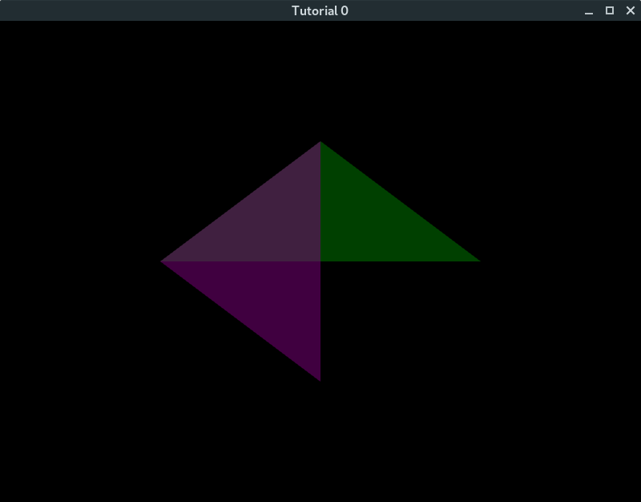
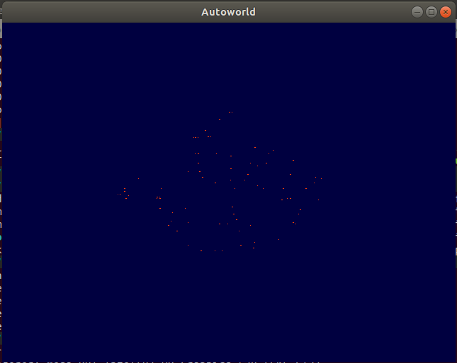
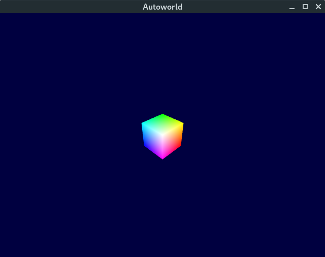
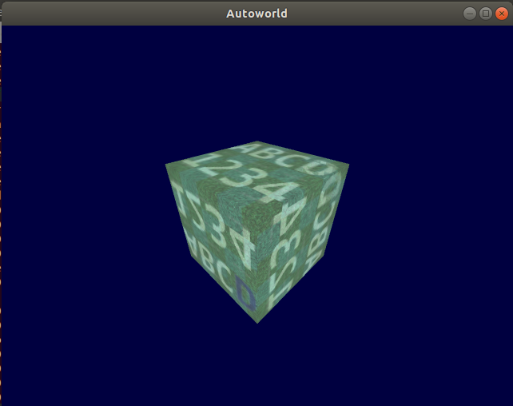
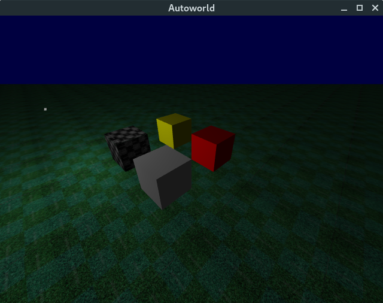
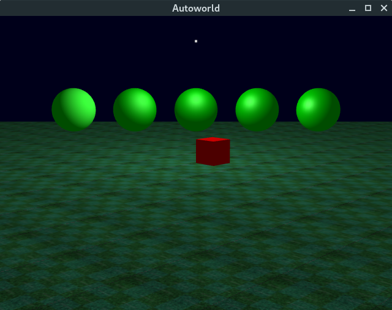

<p align="center">
    
</p>

***

# Autoworld

These tutorials are for the batch 2015-2017 of RKMVERI, OpenGL course (written in C). Please read [LICENSE](LICENSE) for more details.


## Installation

=======
Installation requirements (Debian system aka GNU/Linux, valid at least upto 2016-2020): 
autotools, libglew, libglfw3, libfreetype2, libpng, libm

Libtool is mostly needed to show how a small library libcommon.a can be created, though strictly 
it is not necessary.

```
$ apt-get install autoconf automake libtool libglew-dev libglfw3-dev libfreetype-dev
$ chmod 777 autogen.sh
$ ./autogen.sh
$ ./configure
$ make
$ cd src
```


## Examples

#### Tutorial 0 - OpenGL initialization, single buffer

```
$ ./tut0
```




#### Tutorial 1 - Simple OpenFL operations, multiple buffers

```
$ ./tut1
```




#### Tutorial 2 - Transformations

```

$ ./tut2
```




#### Tutorial 3 - Textures

```
$ ./tut3
```




#### Tutorial 4 - Lighting on flat surfaces

```
$ ./tut4
```



#### Tutorial 5 - Lighting on curved surfaces

```
$ ./tut5
```


***
